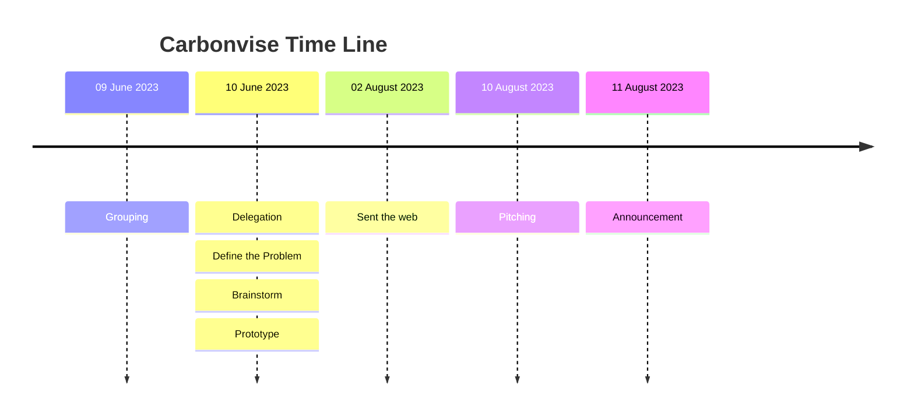

# CARBONVISE

## [Chestnut team #3rd Prize Winner](https://cep.or.th/carbonapp-01)

```mermaid
timeline
    title Carbonvise Time Line
    09 June 2023 : Grouping
    10 June 2023 : Delegation
        : Define the Problem
        : Brainstorm
        : Prototype
    02 August 2023 : Sent the web
    10 August 2023 : Pitching
    11 August 2023 : Announcement
```
