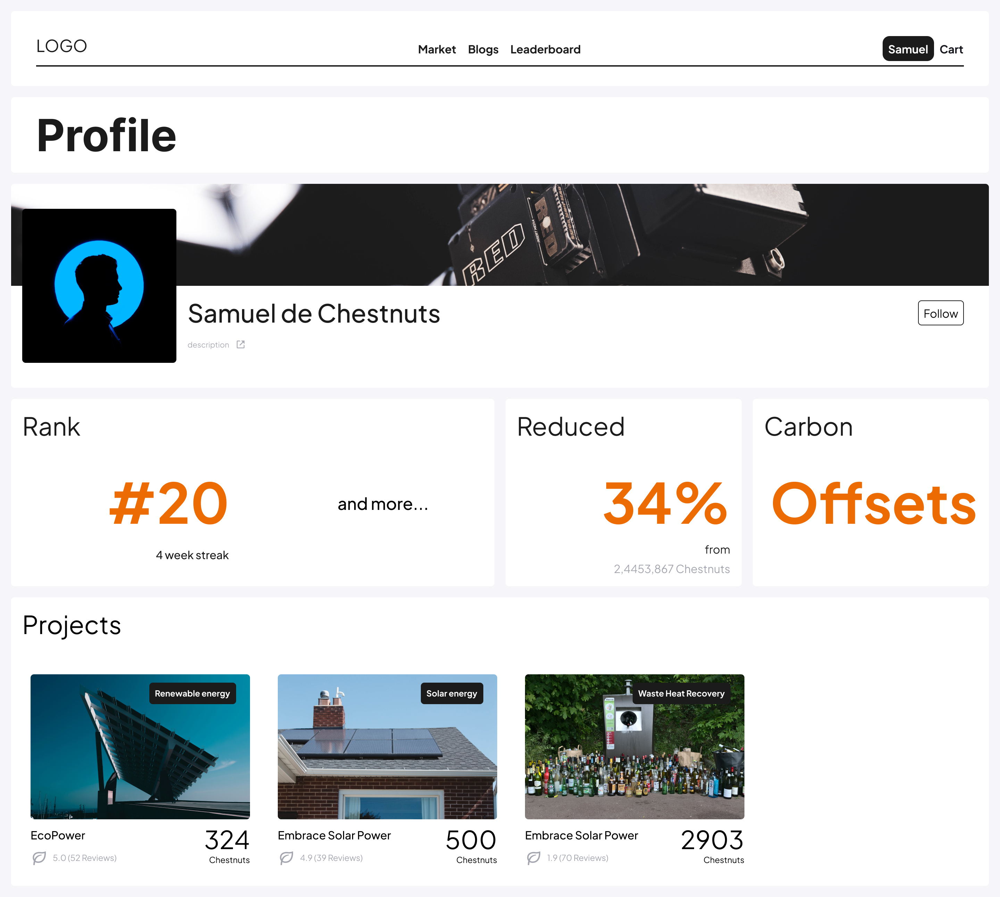
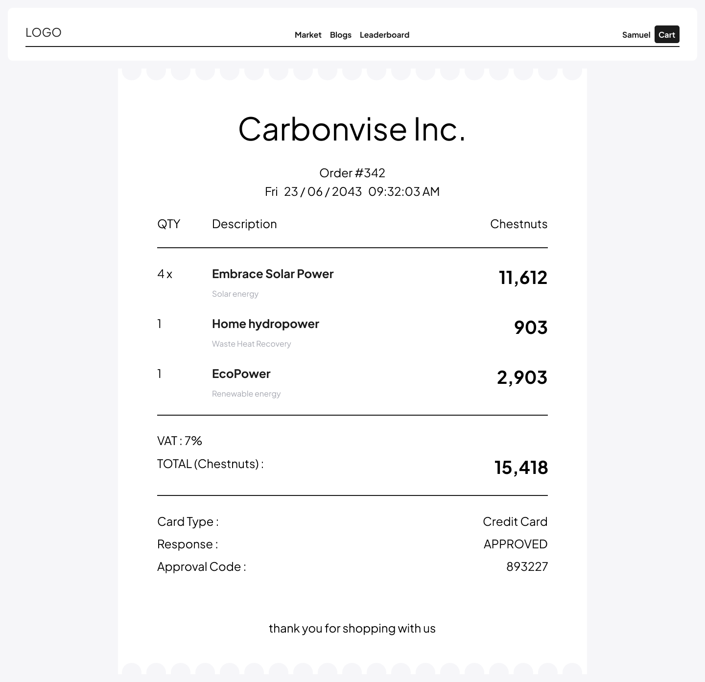
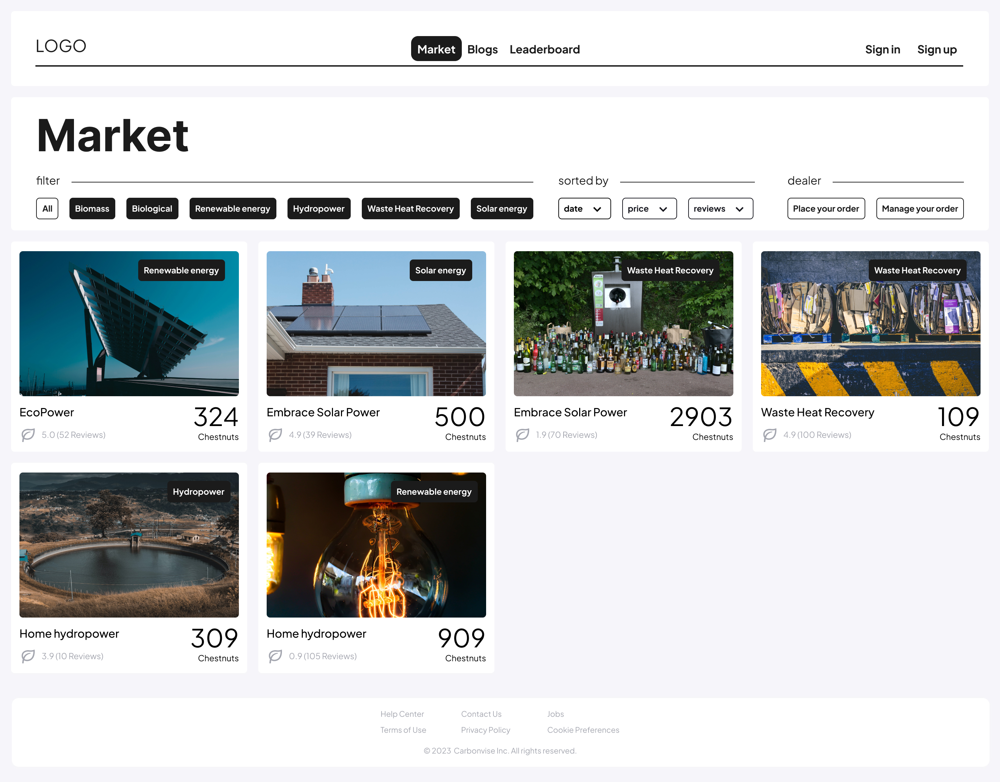
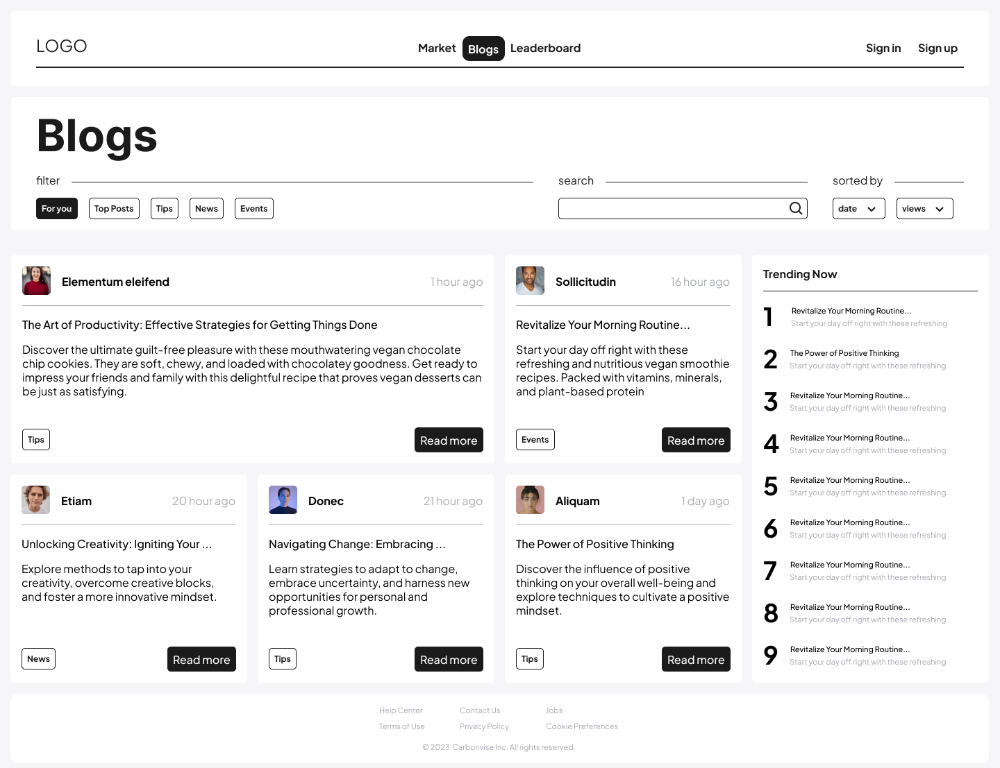
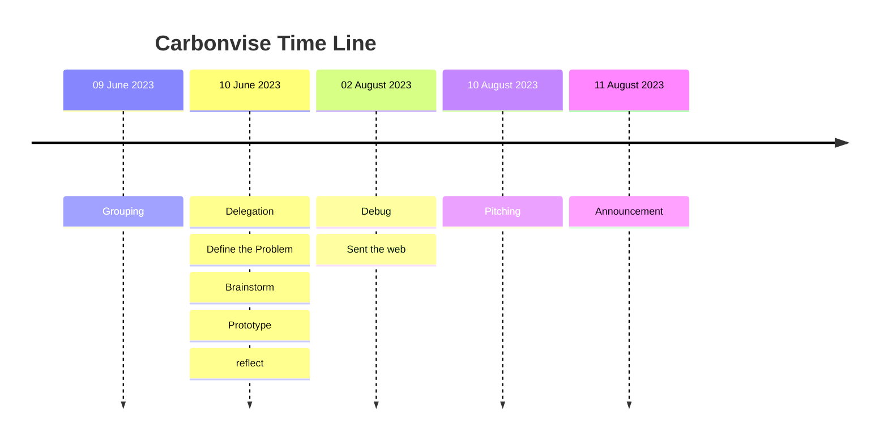

# CARBONVISE

## [Chestnut team - 3rd Prize Winner](https://cep.or.th/carbonapp-01)

## Design

    

        
        
    

    

        
        
    

### Color Palette

## Timeline

```mermaid
timeline
    title Carbonvise Time Line
    09 June 2023 : Grouping
    10 June 2023 : Delegation
        : Define the Problem
        : Brainstorm
        : Prototype
        : reflect
    02 August 2023 : Debug
        : Sent the web
    10 August 2023 : Pitching
    11 August 2023 : Announcement
```
